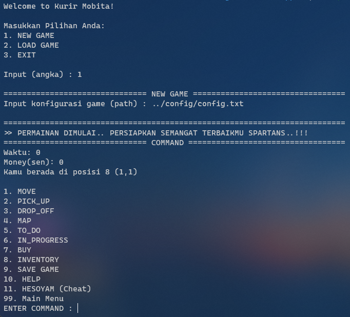

# Tubes-Algeo-Valerie

- 13520069 Kent Liusudarso
- 13520090 Rahmat Rafid Akbar
- 13520102 Ilham Bintang Nurmansyah
- 13520106 Roby Purnomo
- 13520108 Muhammad Rakha Athaya

# Modulasi Program
```
├───app
│   ├───main
│   ├───drop_pick
│   ├───help
│   ├───inprogress
│   ├───inventory
│   ├───map
│   ├───move
│   ├───readfile
│   ├───to_do
│   └───buy
├───config
├───lib
│   ├───ADT
│   │   ├───list
│   │   ├───linked
│   │   ├───gadget
│   │   ├───input
│   │   ├───gadget
│   │   ├───matrix
│   │   ├───queue
│   │   ├───player
│   │   ├───stack
│   │   └───other
│   └───helper
│       └───pcolor
└───save
```
# Cara Run File

1. Pergi ke folder "app"
2. Lalu run main.c
3. Pilih New Game
4. Masukkan path ../config/config.txt
5. Selamat Bermain! :>

# Tampilan Menu Utama

